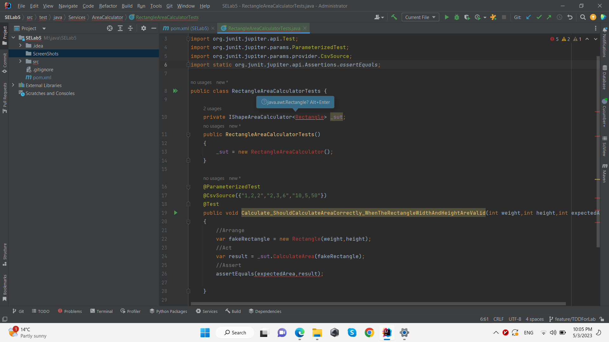
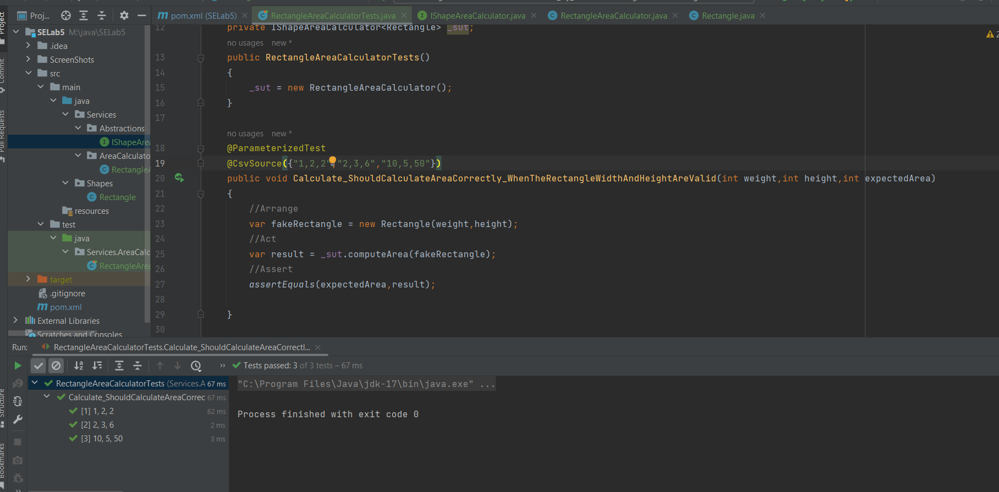
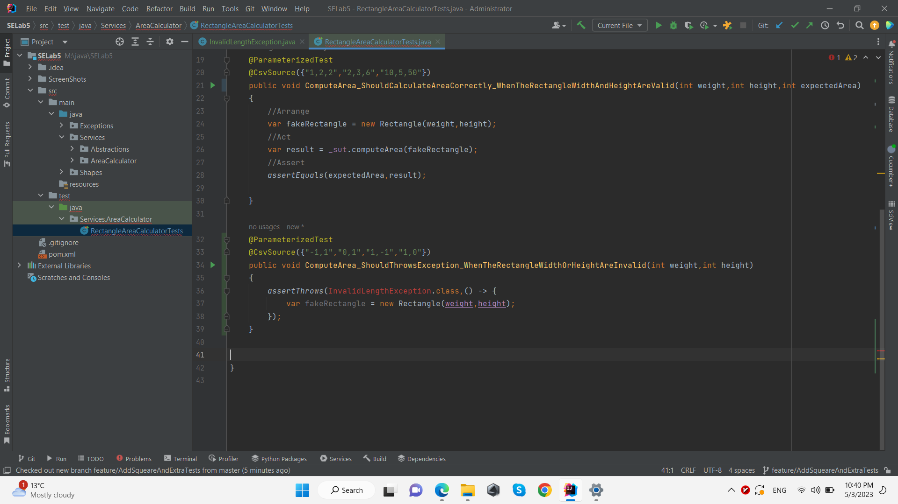
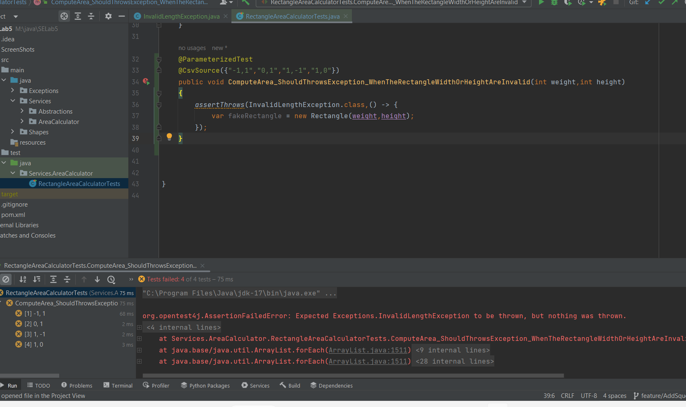
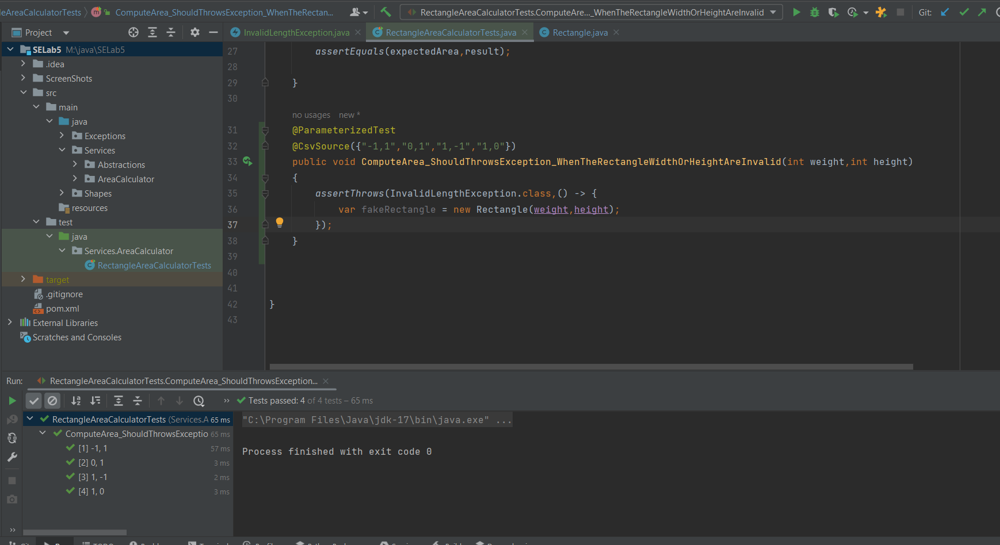

PART1:

در قسمت اول انجام آزمایش از روش TDD برای کد نویسی استفاده شده است بدین صورت که تست مربوط به هر فیچر نوشته شده مشکلات کامپایل آن رفع شده و سپس تست رد میشود و کد مربوطه نوشته شده و در آخر نیز تست پاس خواهد شد.

در شکل های زیر کدزدن بدین روش را میتوانید ببینید.

ابتدا فیچر مربوط به مستطیل را میبینید

همچنین تست دیگر برای آن که وقتی که طول مستطیل نامعتبر است

مابقی فیچر ها مثل مربع و محاسبه مساحت آن نیز با استفاده از روش TDD نوشته شده است.

در این قسمت برای رعایت اصل Liskov از اصول solid هر کدام از اشکال مربوط به مربع و مستطیل یک کلاس جداگانه بودند که از یکدیگر ارث بری نمیکردند و صرفا کلاس های مدل بودند.

برای رعایت SRP نیز محاسبه مساحت از کلاس های مربع و مستطیل حذف شد تا این کلاس ها صرفا یک دارنده برای مشخصات اصلی هر شکل باشد و برای چک کردن معتبر بودن طول ها یک استثنا نیز اضافه شد.

برای رعایت DIP نیز این مدل در نظر گرفته شد که یک interface جدا که جنریک است برای محاسبه مساحت در نظر گرفته شد. که این interface برای اشکال محتلف پیاده سازی مختلف دارد و در کلاس های دیگر میتواند inject شود.

این interface دو پیاده سازی یکی برای محاسبه مساحت مربع و دیگری برای محاسبه مساحت مستطیل دارد که هر دوی آن ها در کلاس های تست مربوطه inject شده اند.

از این به بعد اگر شکل جدید اضافه شود در کلاس های مدل صرفا مشخصات آن شکل اضافه شده و یک پیاده سازی جدید از interface مربوط به محاسبه مساحت انجام خواهد شد.

کلاس های مدل نیز درگیر محاسبه مساحت و ... نیستند. پس بنابراین علاوه بر اصل های فوق OCP نیز رعایت شده است زیرا تا حد امکان از تغییرات جلوگیری میشود و صرفا فیچر جدید اضافه میشود.

Part2:

